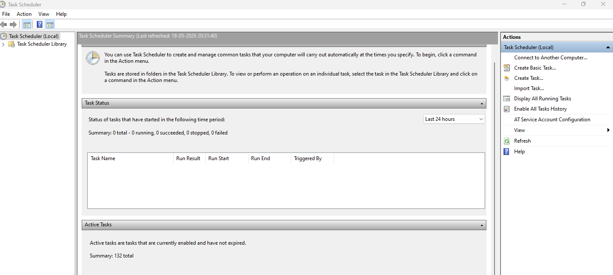
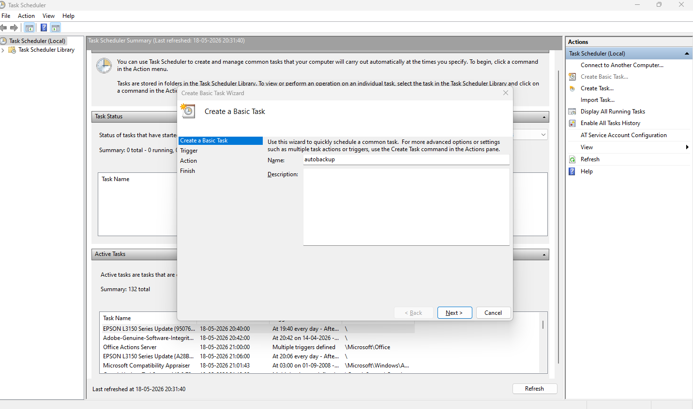
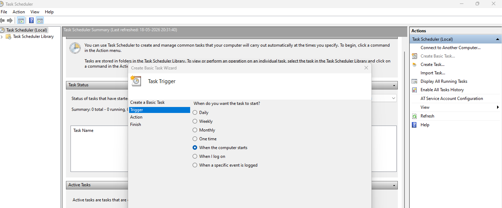
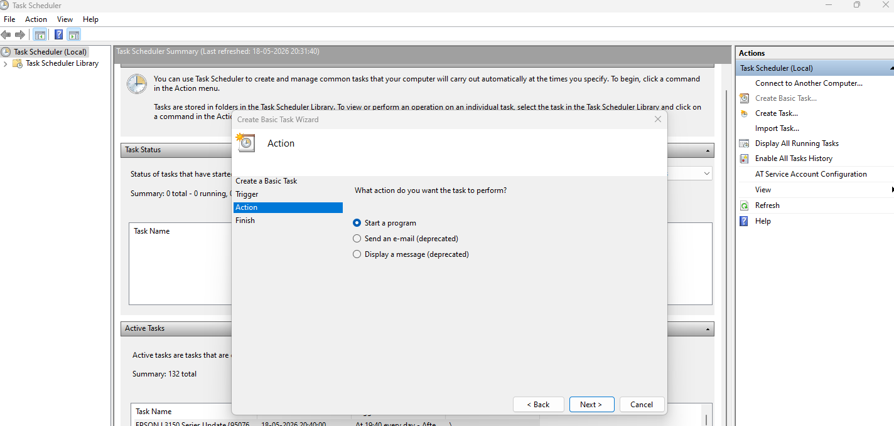
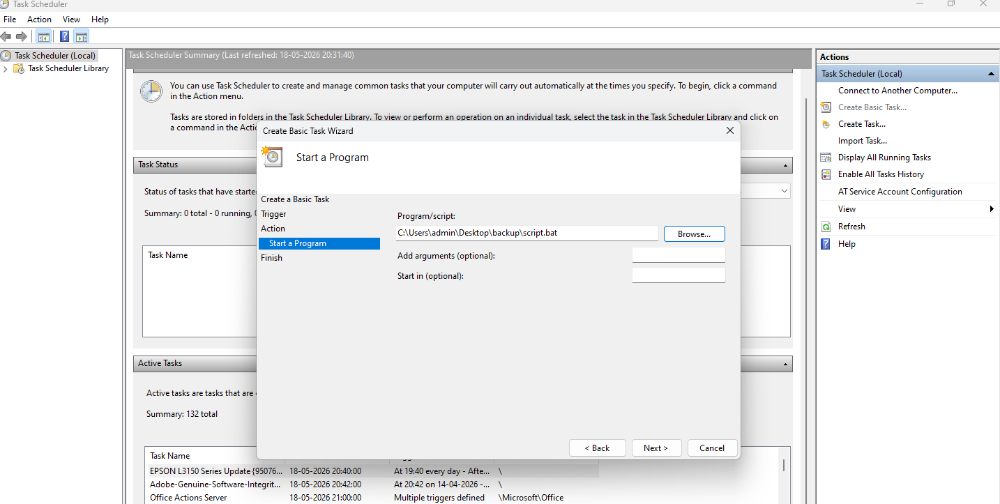
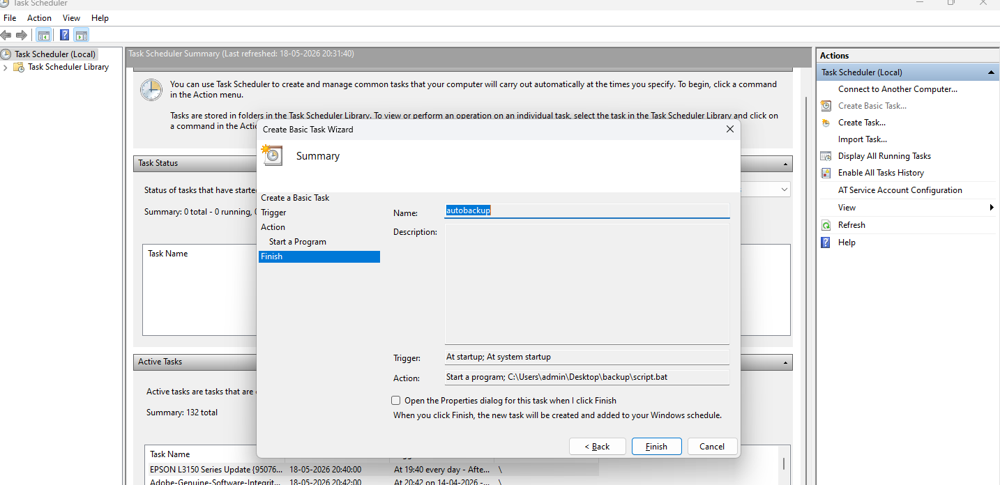

# 🖥️ Auto Backup Desktop to D: Drive

Automated backup solution for Windows that copies all files from your **Desktop** to the **D: drive** using a scheduled task.

---

## 🚀 Setup Instructions

1. **Clone Repository**
   - Run the following command:
     ```bash
     git clone https://github.com/chayeshkunkolkar07-commits/autobackupwindowsfile.git
     ```

2. **Create Scheduled Task**
   a. Open **Task Scheduler** (`Win + R → taskschd.msc`)  
   b. Select **Create Basic Task** → Name: `Desktop_Auto_Backup`  
   c. Choose **Daily** (or preferred frequency)  
   d. Action → **Start a Program** → Select `backup_desktop.bat`  
   e. Save and test by running the task manually
## 📸 task schedule 
1. click basic Task 

step 2

step 3  

step 4

step 5

step 6



   
